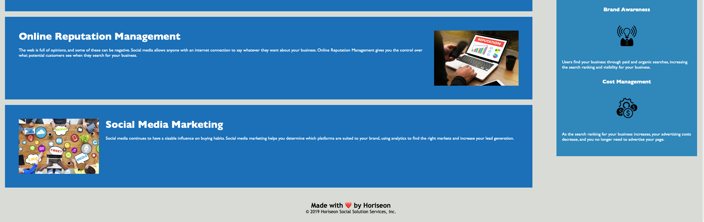

# challenge-one

## Description
I have been tasked with refactoring and improving code provided to me by Horiseon Marketing Agency. My main goal is to ensure their website meets current accessibility standards. Accessbility within webpages is a very important element of web development as this ensures everyone can use websites as they are intended to be used. This is espcially crucial for individuals with vision impairment, for example, as acessbible code will allow programs such as screen readers to work properly and efficiently. 

The following changes have also been implemented: 
    - Reabability has improved: Code now follows a distinct order, allowing future developers to better navigate the code should they need to. This is important as it will save future developers time if they need to make any considerable changes 
    - ALT tags have been given to images. In cases of screen readers, or poor connection issues, the ALT text will either display or be read out to the user. This will ensure that no one is missing out on any content of the webpage.
    - Semantic Elements have now been introduced within the HTML document. This comes hand in hand with the readability also introduced. This will allow developers to know exactly what a particular section of code does. Most dividing elements have been removed and replaced accordingly when applicable.
    - Classes within CSS have also been edited and altered. Previously, there were many classes which could have been condensed into one reference. The code now follows a logical sequence and matches the order of the HTML document. 

## Installation

Please follow this live URL to gain access to the completed work: 

## Instructions

Please see Github pages or the link above to view the deployed application. 

## Credit

Although this project was primarily worked on by myself only, I have watched some tutorials on YouTube and read some articles relating to semantic HTML. They are as follows:

    - [Semantic HTML](https://www.w3schools.com/html/html5_semantic_elements.asp)
    - [Image `alt` attributes](https://www.w3schools.com/tags/att_img_alt.asp)
    - [Semantic HTML Tags | HTML5 Sematic Elements Tutorial] (https://www.youtube.com/watch?v=kX3TfdUqpuU)
    - [Why & When to Use Semantic HTML Elements over Divs] (https://www.youtube.com/watch?v=bOUhq46fd5g&t=520s)
    - [When to Use Semantic HTML Elements Instead of Divs] (https://www.youtube.com/watch?v=ZThq93Yuwd0)

## License 

MIT License

Copyright (c) 2023 Tom Brough

Permission is hereby granted, free of charge, to any person obtaining a copy
of this software and associated documentation files (the "Software"), to deal
in the Software without restriction, including without limitation the rights
to use, copy, modify, merge, publish, distribute, sublicense, and/or sell
copies of the Software, and to permit persons to whom the Software is
furnished to do so, subject to the following conditions:

The above copyright notice and this permission notice shall be included in all
copies or substantial portions of the Software.

THE SOFTWARE IS PROVIDED "AS IS", WITHOUT WARRANTY OF ANY KIND, EXPRESS OR
IMPLIED, INCLUDING BUT NOT LIMITED TO THE WARRANTIES OF MERCHANTABILITY,
FITNESS FOR A PARTICULAR PURPOSE AND NONINFRINGEMENT. IN NO EVENT SHALL THE
AUTHORS OR COPYRIGHT HOLDERS BE LIABLE FOR ANY CLAIM, DAMAGES OR OTHER
LIABILITY, WHETHER IN AN ACTION OF CONTRACT, TORT OR OTHERWISE, ARISING FROM,
OUT OF OR IN CONNECTION WITH THE SOFTWARE OR THE USE OR OTHER DEALINGS IN THE
SOFTWARE.

